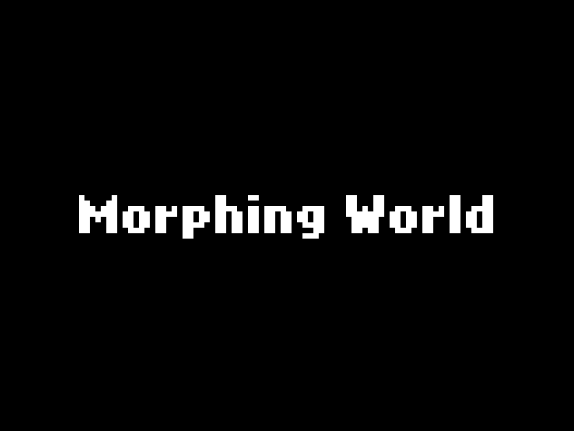
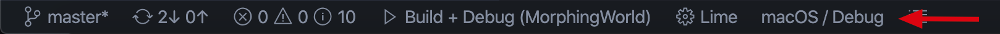

# MorphingWorld

A game inspired by winner game World Collector on Ludum Dare 45.



## Download
The game is available on [GameJolt](https://gamejolt.com/games/Morphingworld/475838).

## Install required libraries

To build this project, you need to first download [Haxe](https://haxe.org/).

Then, install the latest stable version of HaxeFlixel:

```bash
haxelib install lime
haxelib install openfl
haxelib install flixel
```

After the installation is complete, you can compile games to HTML5, Flash and Neko out of the box.
To easily install additional libraries (addons, ui, demos, tools, templates...) in a single step, just run:

```bash
haxelib run lime setup flixel
```

You can run this command to make `lime` vailable as a command (alias for `haxelib run lime`).

```bash
haxelib run lime setup
```

Run the following two commands to install other flixel related dependancies:
```bash
haxelib install flixel-addons
haxelib install flixel-ui
haxelib install flixel-tools
haxelib run flixel-tools setup
```

Install the required dependencies of lycan:

```bash
haxelib install nape-haxe4
haxelib install tink_macro
haxelib install tink_lang
haxelib install hscript
```

## Install tools for development

Please install [Haxe VSCode plugin](https://marketplace.visualstudio.com/items?itemName=nadako.vshaxe) and [HXCPP Debugger](https://marketplace.visualstudio.com/items?itemName=vshaxe.hxcpp-debugger). If you want you can also install the [Haxe Extention Pack](https://marketplace.visualstudio.com/items?itemName=vshaxe.haxe-extension-pack) in VSCode (but it includes some extra package needed for flash development that we don't need).

After you install the [HXCPP Debugger](https://marketplace.visualstudio.com/items?itemName=vshaxe.hxcpp-debugger) (included in the [Haxe Extention Pack](https://marketplace.visualstudio.com/items?itemName=vshaxe.haxe-extension-pack)), you need to run `HXCPP Debugger: SETUP` in VSCode by pressing `F1` and enter `HXCPP Debugger: SETUP`.

## Use HXCPP Debugger

First, make sure at the bottom status bar of VSCode shows Lime, and then you should click the button at the right side of it to choose the target (remember chooose the `xxx/Debug` version).



Then you can go to the debug tab of vscode, choose the `Build + Debug` option and run it.

## Stylecheck

To auto-stylecheck, please install [Haxe Checkstyle](https://marketplace.visualstudio.com/items?itemName=vshaxe.haxe-checkstyle) in VSCode.

## Test

```bash
lime test windows
lime test mac
lime test linux
lime test neko
lime test html5
lime test flash
lime test ios
lime test android
lime test air
```
## Troubleshooting
If encountered `Error: Could not find <lib>, does it need to be installed?`, run `haxelib install <lib>` to install.

If encountered `Error: Could not find "hxcpp-debug-server", does it need to be installed?`, go to visual studio code, install extention Hxcpp Debugger, and use command p in vscode, type in ">" and select "Hxcpp Debugger: Setup".
